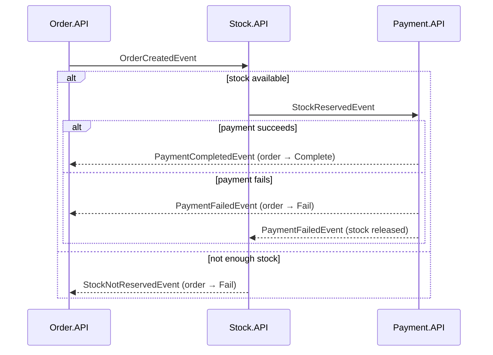

# Saga Choreography Pattern

An order flow across three services with **no central coordinator**: each service reacts to the others' events over **RabbitMQ** (MassTransit), and a failed payment triggers compensating actions.

> **Study project (2021–2022).** Built while learning the choreography style of the saga pattern. See [How I would build it today](#how-i-would-build-it-today).

Companion repo: [SagaOrchestrationPattern](https://github.com/mecemis/SagaOrchestrationPattern) implements the same flow with a central state machine.

## Services

| Project | Role | Storage |
|---|---|---|
| `Order.API` | Creates the order and publishes `OrderCreatedEvent`; completes or fails the order | SQL Server (EF Core) |
| `Stock.API` | Reserves stock; releases it when payment fails | EF Core InMemory (seeded with 2 products) |
| `Payment.API` | Simulates a card payment against a fixed balance | none |
| `Shared` | Event contracts and queue names | |

## Flow

Compensation lives in the services themselves: `Stock.API/Consumers/PaymentFailedEventConsumer.cs` puts the reserved quantities back.

## Tech

.NET 5 · ASP.NET Core · MassTransit 7 · RabbitMQ · EF Core 5 · SQL Server

## Running locally

Prerequisites: RabbitMQ and SQL Server (see the Docker commands in the orchestration repo's README).

1. Set the `SqlCon` and `RabbitMQ` connection strings through user secrets or environment variables.
2. `Order.API` has no committed migrations: run `dotnet ef migrations add Initial --project Order.API`, then `dotnet ef database update --project Order.API`.
3. Start `Order.API`, `Stock.API` and `Payment.API`, and create an order with `POST /api/orders` from `Order.API`'s Swagger UI.

The projects target .NET 5, which is out of support. They build with a current SDK; to run them you need the .NET 5 runtime or `DOTNET_ROLL_FORWARD=Major`.

## How I would build it today

- **Transactional outbox.** Save the order and publish `OrderCreatedEvent` in one transaction, so the two can never disagree.
- **Idempotent consumers.** RabbitMQ delivers at least once, so each consumer would record the messages it has handled (MassTransit's inbox), and a redelivered `PaymentFailedEvent` would release stock only once.
- **Atomic stock reservation.** Reserve all items in a single conditional update, so concurrent orders can't oversell.
- **Payment tokens instead of card data** in `OrderCreatedEvent`.
- **Current stack and tests.** A supported .NET version and consumer tests with MassTransit's test harness.
